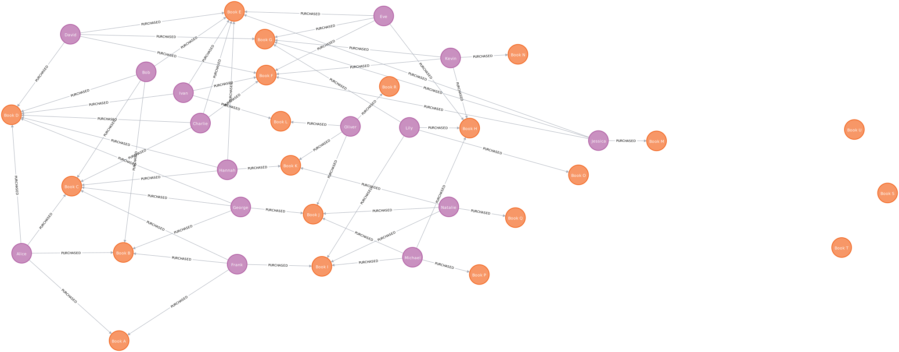

# Quicker Recommendation Engines with Neo4j



Half a second can be the difference between a sale and a lost opportunity. 

In the fast-paced world of e-commerce, where customer attention spans are short and competition is fierce, even the slightest delay in loading times or responsiveness can lead potential buyers to abandon their carts or seek alternatives elsewhere.

Using a lighting fast graph database instead of your legacy SQL database will convert more clicks to sales. 

### Easy to Build

Neo4j is built for the highly connected data that powers modern recommendation engines. Let's compare two queries.

**First Neo4j:**

```cypher
match (u:User {name:'Alice'})-[:PURCHASED]->(p:Product)<-[:PURCHASED]-(peer:User)-[:PURCHASED]->(rec:Product)
where not (u)-[:PURCHASED]->(rec)
return rec.name as title, count(*) as count
order by count desc
```

Here, you express the query naturally, focusing on nodes and their relationships, which makes development a breeze.

**Let's compare that to SQL:**

```sql
WITH common_books AS (
  SELECT p.name AS book
  FROM Products p
  JOIN Purchases pu1 ON p.name = pu1.product_name AND pu1.user_name = 'Alice'
  JOIN Purchases pu2 ON p.name = pu2.product_name AND pu2.user_name <> 'Alice'
  WHERE EXISTS (
    SELECT 1
    FROM Purchases pu3
    WHERE pu1.user_name <> pu3.user_name
    AND pu2.user_name = pu3.user_name
    AND pu3.product_name = p.name
  )
  GROUP BY p.name
),
user_purchases AS (
  SELECT p.user_name as commoner
  FROM Purchases p
  WHERE p.product_name IN (SELECT book FROM common_books)
  AND p.user_name <> 'Alice'
)
SELECT product_name, count(*)
FROM purchases as final
inner join user_purchases u on final.user_name = u.commoner
where product_name not in (select book from common_books)
group by product_name
order by count desc;

```

The SQL query involves complex subqueries and joins, which are harder to write and can be considerably slower.

Simplified development enable faster and higher-quality product launches.

### Built for Speed

According to [internal speed tests](https://Neo4j.com/news/how-much-faster-is-a-graph-database-really/), a simple friends of friends query is ***60% faster*** in Neo4j than in MySQL. As the number of degrees of separation between starting and ending points increases, execution time grows exponentially.

| Depth | Execution Time – MySQL | Execution Time –Neo4j |
| ----- | ---------------------- | --------------------- |
| 2     | 0.016                  | 0.010                 |
| 3     | 30.267                 | 0.168                 |
| 4     | 1,543.505              | 1.359                 |
| 5     | Not Finished in 1 Hour | 2.132                 |

Faster query execution generates more sales and more revenue.

### Easy to Intergrate

Using Neo4j in your existing stack is simple. Let's take a look how in python:

```python
from neo4j import GraphDatabase

URI = "bolt://localhost:7687"  # Replace with your database URI
AUTH = ("neo4j", "password")  # Replace with your username and password

with GraphDatabase.driver(URI, auth=AUTH) as driver:
    driver.verify_connectivity()
    print("Connection estabilished.")

query = """match (u:User {name: $name})-[:PURCHASED]->(p:Product)<-[:PURCHASED]-(peer:User)-[:PURCHASED]->(rec:Product)
where not (u)-[:PURCHASED]->(rec)
return rec.name as title, count(*) as count
order by count desc"""

with driver.session() as session:
    results = session.run(query, name='Alice')
    records = [record.data() for record in results]
    
    print(type(records))
    print(records)

driver.close()
```

Simply import `neo4j`, establish your driver, and execute your query directly from Python, harnessing the power of graph databases in your application.

---

- **GitHub Repository Contents:**
  - **`set_updatabases` folder:** Provides scripts to set up identical databases in Neo4j and PostgreSQL for running the queries mentioned.
  - **`queries` folder:** Contains sample queries to execute against the prepared databases.
  - **`images` folder:** Houses images used in this readme.
  - **`app` folder:** Includes a basic Flask application that returns book recommendations based on a user's name.
