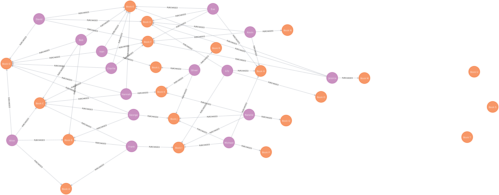

# graph-recommendation



```cypher
match (u:User {name:'Alice'})-[:PURCHASED]->(p:Product)<-[:PURCHASED]-(peer:User)-[:PURCHASED]->(rec:Product)
where not (u)-[:PURCHASED]->(rec)
return rec.name as title, count(*) as count
order by count desc
```

